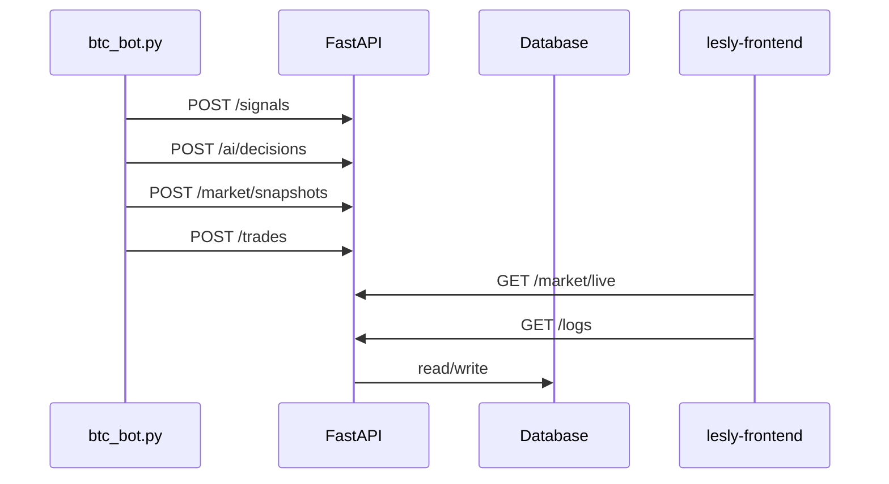

# Backend Architecture — Lesly AI Trading

## Role

The backend is a **persistence and API layer**. It does **not** generate trading signals.

| Component | Responsibility |
|-----------|----------------|
| `btc_bot.py` | Multi-timeframe analysis, risk rules, optional OpenAI assist, Telegram |
| `backend/` | Store signals, snapshots, trades, AI decisions; serve live BTC price to the UI |

## Stack

- FastAPI + SQLAlchemy (async)
- SQLite (`./lesly.db`) for local development
- PostgreSQL (`asyncpg`) for production
- Alembic migrations

## Data flow



## API endpoints

| Method | Path | Description |
|--------|------|-------------|
| GET | `/api/health` | Health + paper mode |
| GET/POST | `/api/signals` | List / create signals |
| GET/POST | `/api/market/snapshots` | Historical snapshots from bot |
| GET | `/api/market/live` | Live BTC price + latest signal |
| GET/POST | `/api/trades` | Paper trade ledger |
| GET | `/api/ai/status` | Engine status from latest signal |
| GET | `/api/ai/performance` | Win rate from closed trades + signal count |
| POST | `/api/ai/decisions` | AI decision log (called by bot) |
| GET | `/api/logs` | AI decision feed for dashboard |
| POST | `/api/db/init` | Dev-only schema bootstrap |

## Database tables

| Table | Written by |
|-------|------------|
| `signals` | Bot via POST `/signals` |
| `ai_decisions` | Bot via POST `/ai/decisions` |
| `market_snapshots` | Bot via POST `/market/snapshots` |
| `trades_paper` | Bot via POST `/trades` |
| `strategy_performance` | Reserved for future use |
| `rejected_signals` | Reserved for future use |
| `learning_notes` | Reserved for future use |

## Configuration

See [`.env.example`](.env.example) and [../DEPLOYMENT.md](../DEPLOYMENT.md).

Key variables:

- `DATABASE_URL` — SQLite or PostgreSQL (auto-normalized for asyncpg)
- `ENVIRONMENT` — `development` or `production`
- `CORS_ORIGINS` — comma-separated frontend URLs
- `SECRET_KEY` — set a strong value in production

## Local run

```bash
cd backend
pip install -r requirements.txt
uvicorn app.main:app --reload --port 8000
```

Production Docker image runs `alembic upgrade head` before Uvicorn.
